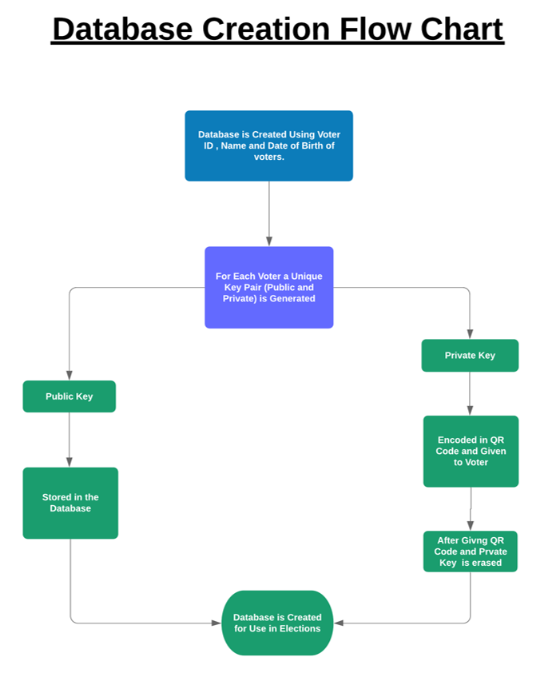
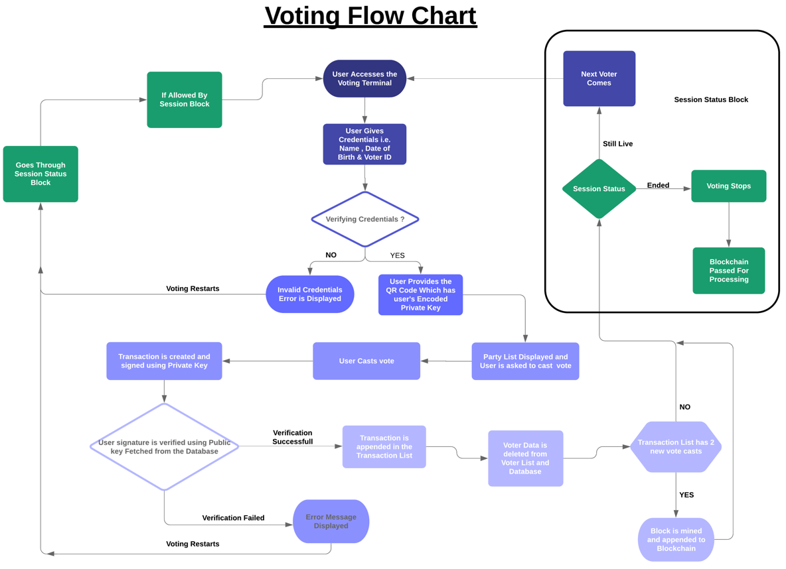
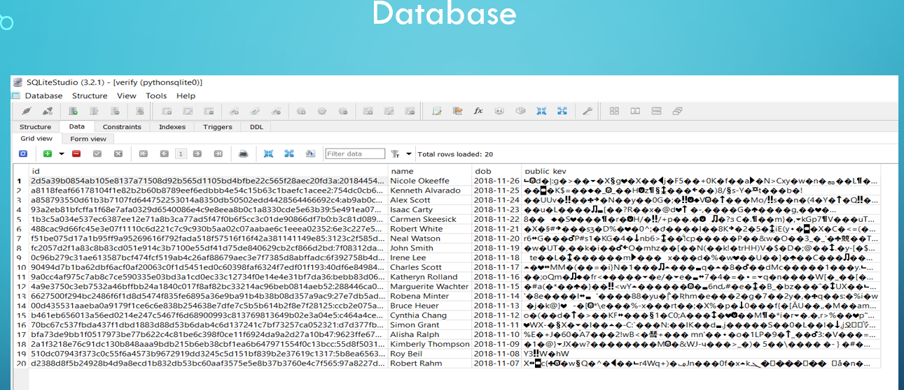
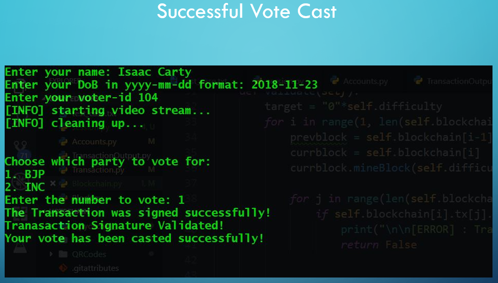
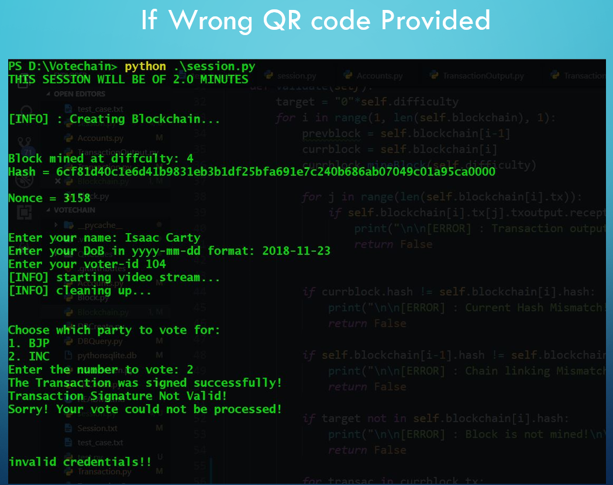
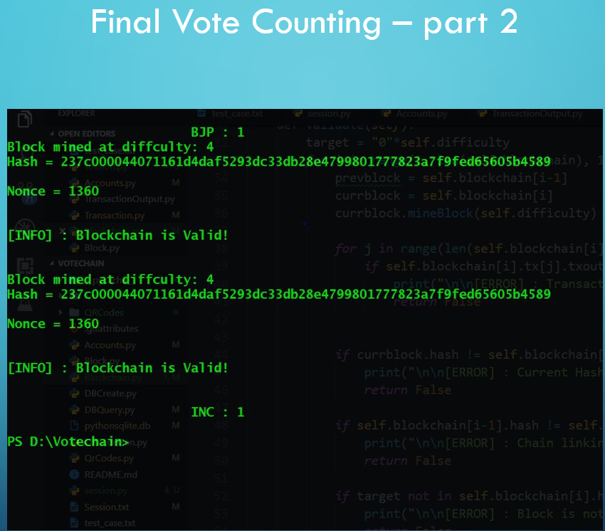
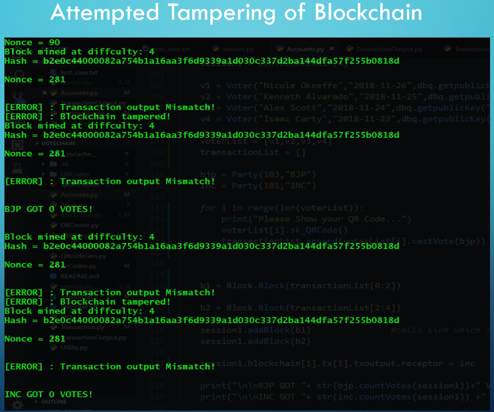

# Votechain

This project simulates voting through blockchain technology

Library Requirements: The following libraries are required to run the complete session:

    ecdsa 0.13
    opencv 4.0.0.21
    pyzbar 0.1.8
    imutils 0.5.2
    pypng
    PyQt 5

# Data Flow is as follows:

# Test Cases:

